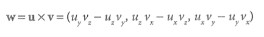
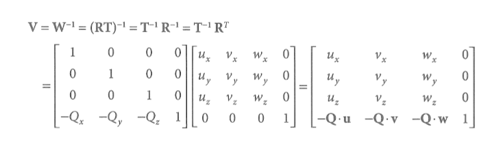

# DX11
>내용 정리
<pre>
목표는 12.15 까지 다 읽기.
며칠 진행해보고 전체적인 일정 정하기.
</pre>

## 19.11.25
<code> ~ 67 page </code>

### vector
- 직교화 : 그람 슈미트 직교화
<div>
 
</div>

- 2차원 벡터의 수직인 벡터를 구하는 방법 : u(ux,uy) ┴ v(-uy, ux) = u·v = ux * -uy + uy * ux

- 외적을 통한 직교화
1. v0을 정규화 ( w0 )
2. w0 X v1을 정규화 ( w2 )
3. w2 X w0 ( w1 )

### XNA Math

- SSE2 ( streaming SIMD extentions 2 )

- SIMD ( single instruction multy data )

- XMVECTOR에 적재하고 저장하는 함수들
1. XMLoadFloat : 적재
2. XMStoreFloat : 저장
3. XMSetFloat : 벡터의 1개 요소 적재
4. XMGetFloat : 벡터의 1개 요소 저장

```cpp

// 32bit window
typedef const XMVECTOR FXMVECTOR
typedef const XMVECTOR& CXMVECTOR

// 64bit window
typedef const XMVECTOR& FXMVECTOR
typedef const XMVECTOR& CXMVECTOR
```

- 함수는 매개변수로 XMVECTOR를 사용할 때 처음 3개는 FXMVECTOR, 다음 3개는 CXMVECTOR를 사용해야 하는
규칙을 지켜야 한다.

- 상수 벡터는 XMVECTORF32를 사용하고 즉시 초기화할 때 사용

## 19.11.26
<code> ~ 136 page </code>

- XMVector3DotEst, XMVector3NormalizeEst는 추정 값을 리턴해 정확도는 떨어지지만 빠르게 값을 얻을 수 있다.

- 부동소수점은 근사 값을 갖기 때문에 오차가 발생해 Equal 함수에서 False를 반환할 수 있다. 그래서 NearEqual함수를 이용해
Epsilon 값을 넘겨, 오차 값과 Epsilon을 비교한다.

> 요약 75

- 사인법칙 : 원에 내접하는 삼각형에 대해 BC/sinA = 2R

- 제1코사인법칙 : BC = ABcosB + CAcosC

- 제2코사인법칙 : BC^2 = AB^2 + CA^2 - 2 AB CA cosA

[법칙 참고 링크](https://www.mathfactory.net/10678)

### matrix

- 행렬간 곱셈으로 만들어지는 행렬의 원소는 원소의 행,열 벡터를 내적한 값을 가진다.

> 요약 101

### tranform

- 벡터에 대한 변환은 선형변환이고, 선형 변환에 점(위치)에 대한 변환을 더한 것이 아핀 변환이다.

- 아핀 공간은 선형 변환으로 표현할 수 없는 것을 표현하고자 필요한 추가 요소를 정의한 공간이다.

- 하나의 4차원 행렬로 아핀 변환를 표현하기 위해 동차좌표를 도입했다.

<pre>
동차좌표는 변수들의 차수나 종류를 구분하기 위한 값으로 봐도 될듯
</pre>

- 결과적으로 능동 변환 행렬( SRT )과 좌표 변환 행렬은 동치이다.

<pre>
벡터 v와 좌표계 A, B, C가 있고 A->B로 가는 좌표 변환 행렬 M1과 B->C로 가는 좌표 변환 행렬 M2가 있다고 할때,
A에 있는 v를 C로 옮긴다고 가정하자.
1)
va * M1 = vb
vb * M2 = vc

2)
va * ( M1 * M2 ) = vc
로 나타낼 수 있는데 vc를 va로 바꿀 때 순서가 중요하다.
(M1 * M2)의 역행렬은 M2^-1 * M1^-1인데 M1의 역행렬을 먼저하면 B에서 A로 좌표 변환하는 행렬이기 때문에 
원하는 좌표 변환이 이뤄지지 않는다.
</pre>

> 요약 130

## 19.11.27
<code> ~ 191 page </code>

### 기본 지식

- DX11은 DX9과 다르게 DX11에서 지원하는 모든 기능을 장치가 제공해야 사용할 수 있다.

- COM ( component object model ) : DX의 언어 독립성과 하위 호환성을 제공하는 인터페이스

- 텍스쳐를 사용하기 위해서는 텍스쳐 초기화 시점에 자원 뷰 ( Resource view )를 생성해야 한다.
리소스 뷰를 사용하는 이유는 런타임에서의 유효성 점검을 뷰 생성 시점에서 수행할 수 있어 바인딩 시점에서
점검이 최소화된다.

- 리소스 뷰는 DX에게 자원의 사용 방식을 알리거나 무형식으로 지정한 자원의 구체적인 형식을 지정할 때 사용한다.

- 슈퍼샘플링은 전체 해상도를 n배 증가시켜 축소하는 방식이라 연산량이나 메모리 사용량이 많다. 반면 멀티샘플링은
필요한 부분 ( 외각선 )만 n배 증가시켜 하는 방식으로 슈퍼샘플링보다 퀄리티는 떨어지더라도 연산 부하가 적다.

### DirectX3D의 초기화

- ID3D11Device는 기능 지원 점검과 자원 할당, ID3D11DeviceContext는 렌더 대상을 설정하고 자원을 그래픽 
파이프 라인에 묶고 GPU가 수행할 렌더링 명령들을 지시하는 데에 사용한다.

- devicecontext는 즉시와 연기 방식이 있고 연기 방식은 멀티 스레드에서 사용한다.

- DXGI ( DirectX Graphics Infrastructure ) : DX와 개별적인 API로 스왑 체인 설정이나 그래픽 하드웨어
나열, 창모드와 전체모드 전환 등 그래픽에 관련된 작업을 처리한다. 다른 그래픽 API에서도 사용할 수 있도록
DX와 분리하였다.

## 19.11.28
<code> ~ 228 page </code>

### 렌더링 파이프라인

- 입력 조립기 ( IA input assembler ) : 기하 자료를 읽어서 기하학적 도형을 조립하는 단계

- 뷰 변환 행렬은 가상 카메라의 로컬 공간에서 월드 공간으로 가는 월드 변환 행렬 ( W = RT )를 구하고 이를
역행렬하여 구할 수 있다.
<div>
 
</div>


- 수평 시야각을 구하는 공식
<div>
 
</div>

## 19.12.02
<code> ~ 228 page </code>

NDC ( normalized device coodinates ) : 뷰 영역의 좌표를 정규화된 좌표로 변환한 좌표

### 테셀레이션 단계

- 테셀레이션은 기존의 삼각형을 더 잘게 쪼개서 새로운 삼각형을 만드는 기술로 DOF 메커니즘을 구현하는 데에
사용한다.

### 기하쉐이더

- 기본 도형을 입력받아 새로운 도형을 만들거나 파괴하는 쉐이더. 기하 쉐이더의 출력 값은 
동차 절단 공간 ( 원근 나누기 전 단계 )의 값으로 변환된 것이여야 한다.

### 래스터라이즈

- 원근 보정 보간

### 색인과 색인 버퍼

- 간단한 도형들의 경우 정점 버퍼와 인덱스 버퍼를 하나로 합쳐 적절한 정점 시작 위치와 인덱스 시작 위치를 DrawIndexed
함수의 2,3번째 매개변수로 넘겨 처리할 수 있다.

### 상수 버퍼

- 상수 버퍼는 갱신될 때, 상수 버퍼 모든 값을 갱신하기 때문에 갱신되는 주기에 따라 상수 버퍼 멤버를 구성해야 된다.

### 효과 프레임워크

- 쉐이더 생성 메커니즘 : 쉐이더 매개변수에 uniform 키워드를 넣어 중복되는 쉐이더 코드를 줄일 수 있다.
