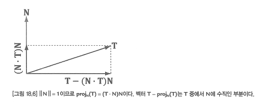

## 20.02.26
<code> ~ 712 page </code>

# 지형 렌더링

- 높이맵 텍스처를 이용해, 텍스처를 2차원 배열로 사용하여 높이 값을 가져와 지형의 높이로 사용하는 방법

## 지형 높이

- 텍스쳐로 값을 가져와 적용하면 거친 지형이 만들어져, 저장했던 높이 값과 다른 모습을 보여준다. 좀 더 평활화(smoothing)하기
위해 주변 값들을 더해 나눠 사용한다.

!사진추가

## 지형의 테셀레이션

- 지형의 정점과 시점과의 거리를 기반으로 테셀레이션의 세분도를 조절하여 지형의 LOD를 구현한다.

>순서
1. 격자 기준을 만들어 정점을 생성한다.
2. 정점 쉐이더에서 높이맵 값을 읽어 대입하여 시점과의 거리를 더 정확히 할 수 있다.
3. 상수 덮개 쉐이더에서 각각 거리 계산하고 insidefactor도 4개의 제어점을 더해 나눠 구한다.
4. 영역 쉐이더에서 정점마다 법선 벡터를 제외한 정점 정보를 연산하여 넘겨주며, 변위 매핑을 수행한다.
5. 픽셀 쉐이더에서 uv 간격과 높이맵에서 읽은 높이로 중심차분법을 통해 탄젠트와 법선을 구한다.

<code> 사각형 패치는 왜 인사이드팩터가 2개? </code>

## 20.02.22
<code> ~ 712 page </code>

## 변위 매핑

- 변위 매핑은 노말 맵과 함께 높이 맵을 이용한다. 테셀레이션으로 노말 벡터와 높이 맵의 값을 이용해 정점의 위치를 이동시키는 방식.

<code> SV_DomainLocation과 정점 3개를 순차적으로 곱해 위치를 구할 수 있는 이유에 대해 찾아봐야 할 것 같음.

## 20.02.21
<code> ~ 705 page </code>

## 법선 매핑

- 정점들의 위치와 텍스쳐 좌표를 통해 접선 공간에서 로컬 공간으로의 변환 행렬을 구할 수 있다.

<div>
 
</div>

- 원근 보정 보간되어 픽셀 쉐이더로 오면 탄젠트와 노말이 정규 직교가 아닐 수 있어, 정규직교화 해야 한다.

<div>
 
</div>

## 20.02.05
<code> ~ 687 page </code>

## 물체의 주변 환경 반사 구현

- 큐브 맵을 반사 벡터를 통해 샘플링하여 계수 값으로 기존 색상과 더해 표현할 수 있다.

## 동적 입방체 맵

> 동적 입방체 순서
1. 큐브 텍스쳐와 렌더 타겟 6개를 만든다.
2. 동적 입방체의 대상 객체의 위치에서 6방향으로 카메라를 만들어 장면을 렌더 타겟에 그린다.
3. 각각의 렌더 타겟으로 큐브 텍스쳐를 만든다.
4. 만든 동적 큐브 텍스쳐로 샘플링한다.

- refract 굴절 벡터를 리턴하는 HLSL 함수

## 20.02.04
<code> ~ 671 page </code>

## 환경매핑

- 큐브맵 로딩도 DDS 텍스쳐 로딩 함수와 동일한 함수로 읽을 수 있다.

## 20.01.26
<code> ~ 645 page </code>

## 경계입체와 시야 절두체

<code>  DirectXCollision.h에 관련 함수가 정의되어 있다. </code>

### 경계입체

- 경계 입체(bounding volume) : 입체적 영역은 근사하는 기본적인 기하학적 입체

- AABB(axis-aligned bounding box) : 축 정렬 경계 상자로 최솟점과 최댓점으로 정의할 수 있다. 중점과 한계 벡터(extents vector)로
표현할 수 있다.

- OBB(oriented bounding box) : 지향 경계상자로 회전된 월드 공간의 객체의 충돌 박스를 계산할 수 있다. 중점과 한계 벡터, 회전을
나타내는 단위 사원수로 표현할 수 있다.

### 절두체

- NDC 공간에서 절두체는 [-1, 1] x [-1, 1] x [0, 1] 범위의 상자로 변환된다.

> 월드 공간 절두체 꼭짓점 구하기
1. NDC 공간 상의 절두체 좌표에 투영 행렬의 역행렬을 곱한다.
2. 기울기를 구하기 위해 각 꼭짓점을 Z 값의 역수와 곱하고 Near와 Far 값은 W 값의 역수로 나눠 거리를 구한다.

## 절두체 선별

- 절두체 선별(Frustum culling)은 래스터라이저 단계에서 진행되지만, 렌더링되지 않는 것을 미리 연산을 통해 알 수 있다면
정점 쉐이더와 추가적으로 테셀레이션이나 기하 쉐이더를 진행하는 비용을 없앨 수 있다.

``` cpp

bool XM_CALLCONV XMMatrixDecompose(_Out_ XMVECTOR *outScale
                                   , _Out_ XMVECTOR *outRotQuat
                                   , _Out_ XMVECTOR *outTrans
                                   , _In_ FXMMATRIX M);
// 행렬의 scale, rotation, translation을 분해하여 개별적인 행렬에 저장해준다.

```

<pre>
이번 챕터에서 DirectXMath와 이 헤더에서 파생된 헤더를 봤는데 선언뿐만 아니라 정의도 볼 수 있어서 참고하고 
틈틈히 보면 많이 도움될 듯.
절두체 컬링의 대상은 로우폴리곤 메쉬로는 오히려 프레임이 저하됨. 테스트를 위해 인스턴스 객체도 했는데 메쉬 로딩 후에 
다시 테스트해봐야 할 듯.
</pre>

## 20.01.26
<code> ~ 625 page </code>

## 테셀레이션

> 테셀레이션을 사용하는 이유
1. 동적 LOD
2. 효율적인 물리 및 애니메이션 계산
3. 메모리 절약

- 테셀레이션은 IA에 삼각형을 제출하지 않고 제어점들로 이루어진 패치들을 제출한다.

- 테셀레이션을 위한 정점 쉐이더는 제어점을 넘겨주게 되는데 필요에 따라 물리나 애니메이션 계산을 하여 변경 후 넘겨준다.

## 덮개 쉐이더 (hull shader)

### 상수 덮개 쉐이더

- 테셀레이션 계수를 출력하며 패치를 얼마나 세분화 할 것인지 결정하며 패치마다 실행된다.

> 패치에 대한 테셀레이션 계수
1. 각 변에 따른 세분 정도를 제어하는 변 테셀레이션 계수
2. 패치 내부의 세분 정도를 제어하는 내부 테셀레이션 계수

> 테셀레이션 정도를 결정하는 측정치
1. 카메라와의 거리
2. 화면 영역 포괄도
3. 방향
4. 표면의 거친 정도

> 성능 최적화를 위해 고려할 점
1. 테셀레이션 계수가 1일 때, 테셀레이션 단계를 연산하는 것
2. 픽셀이 8개 미만일 정도로 작은 삼각형일 때
3. 테셀레이션을 사용하는 경우 일괄적으로 묶어서 처리

### 제어점 덮개 쉐이더

- 제어점들을 변경하거나 추가하는 역할로 제어점마다 실행된다. 덮개 쉐이더는 표면의 표현을 변경할 때도 사용하는데
곡선 표현등에 사용하는 것 같음.

``` hlsl
[domain("quad")] // 패치의 종류 (tri, quad, isoline)
[partitioning("integer")] // 테셀레이션 세분 모드 지정 (integer, fractional_even, fractional_odd)
[outputtopology("triangle_cw")] // 삼각형의 감김 순서 (trialgle_cw, triangle_ccw, line)
[outputcontrolpoints(4)] // 덮개 쉐이더가 출력할 제어점의 갯수
[patchconstantfunc("ConstantHS")] // 상수 덮개 쉐이더 함수 이름
[maxtessfactor(64.f)] // 테셀레이션 계수의 최대값.
//DX11의 최대값은 64이고 최대값을 알고 있으면 자원 추정이 가능해 최적화 여지가 있음
```

## 테셀레이터 단계

- 이 단계에서는 직접적으로 해주는 것은 없고 하드웨어에서 제어한다.

## 영역 쉐이더 (domain shader)

- 테셀레이션된 패치에 대한 정점 쉐이더로 작용하는 쉐이더. 영역 쉐이더가 실제 정점 위치를 입력받는 것이 아닌 
패치 영역 공간안에서의 그 점의 매개변수 좌표(u, v)를 받는다. 이 매개변수 좌표와 제어점들로부터 실제 3차원 정점
위치를 유도하는 것은 영역 쉐이더가 해야 될 연산.

## 베지어 사각형 패치

- 선형 보간을 거듭하여 곡선을 나타낼 수 있고, 베른슈타인 기저 함수를 통해 n차 베지어 곡선 공식을 구할 수 있다.

# 응용

## 1인칭 카메라 만들기

## 하드웨어 인스턴싱

- 한 장면에서 같은 물체를 여러 번 그리되 위치나 방향, 척도, 재질, 텍스처 등을 달리 해서 그리는 것

- batching : 그래픽 엔진들의 일괄 처리 기법

<code> 그래픽 카드 영향이 있을 거 같은데 프레임에서 꽤 상승한 모습이 보이긴하지만 후에 메쉬로 테스트 해봐야 할 것 같음 </code>
